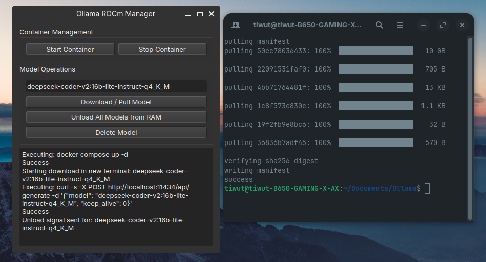

# Ollama ROCm Manager - For Docker Compose

## Overview
This repository provides a simple GUI-based application named "Ollama ROCm Manager" designed to manage the lifecycle of AI models using Docker and Docker Compose. The application allows users to start, stop, download/pull, and unload models from an Ollama container with ROCm support. It also includes features for managing container operations through a user-friendly interface.



## Features
- **Model Management:** Download or pull new models into the system.
- **Container Control:** Start and stop Docker containers effortlessly.
- **Unload Models:** Remove models from RAM to free up resources.
- **User Interface:** Easy-to-use graphical user interface (GUI) with Qt Widgets for managing operations.

## Installation & Setup
### Prerequisites
Ensure you have the following installed on your system:
- Docker and Docker Compose ([Install Guide](https://docs.docker.com/get-docker/))
- ROCm enabled GPU (for model execution)
- Qt6 development libraries (for building the GUI)

### Steps to Run
1. **Clone the Repository:**
   ```bash
   git clone https://github.com/tiwut/Ollama-ROCm-Manager---for-Docker-Compose.git
   cd Ollama-ROCm-Manager---for-Docker-Compose
   ```
2. **Modify Docker Configuration:**
   Edit the `docker-compose.yml` file to ensure it matches your setup, particularly paths and service names.
3. **Build and Run the Application:**
   Use Qt Creator or compile using Makefile provided:
   ```bash
   qmake6 OllamaManager.pro
   make
   ./OllamaManager
   ```
4. **Run Docker Container:**
   Start your Docker container with the necessary configurations as specified in `docker-compose.yml`.
5. **Use the Application:**
   Open the application, input model names and perform operations through the GUI buttons.

## Usage
### Interface Breakdown
- **Model Input Field:** Enter the name of the AI model you wish to manage.
- **Download/Pull Button:** Downloads or pulls a specified AI model into your system.
- **Unload Button:** Unloads the currently selected model from RAM.
- **Start/Stop Buttons:** Controls the Docker container's lifecycle.
- **Log Output:** Displays messages related to operations and errors in real-time.

## Contributing
Pull requests are welcome. For major changes, please open an issue first to discuss what you would like to change. Please make sure to update tests as appropriate.

## License
This project is licensed under the GPL-3.0 license License - see the [LICENSE](LICENSE) file for details.

[Tiwut](https://tiwut.org)
